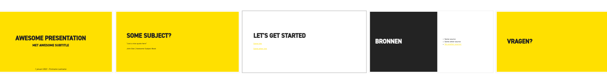
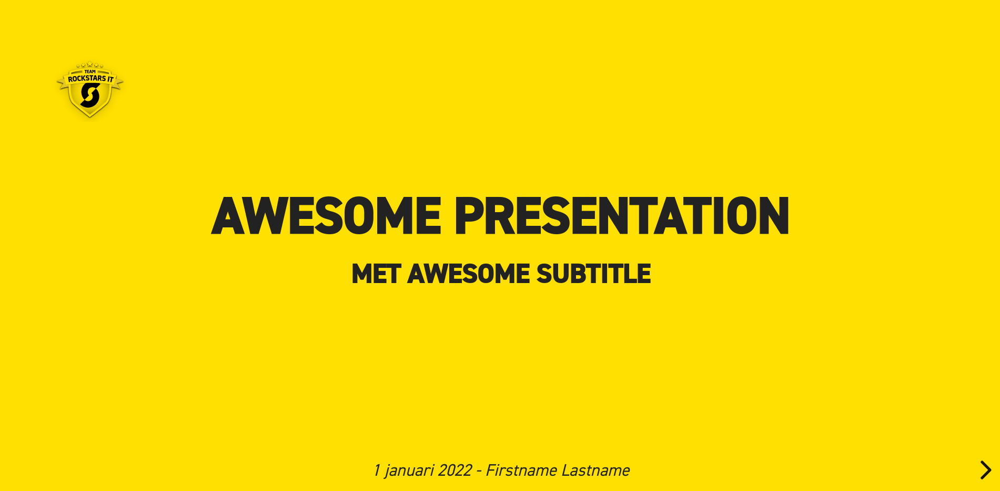
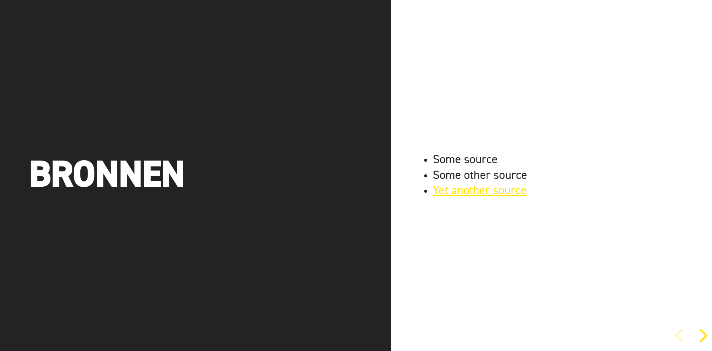
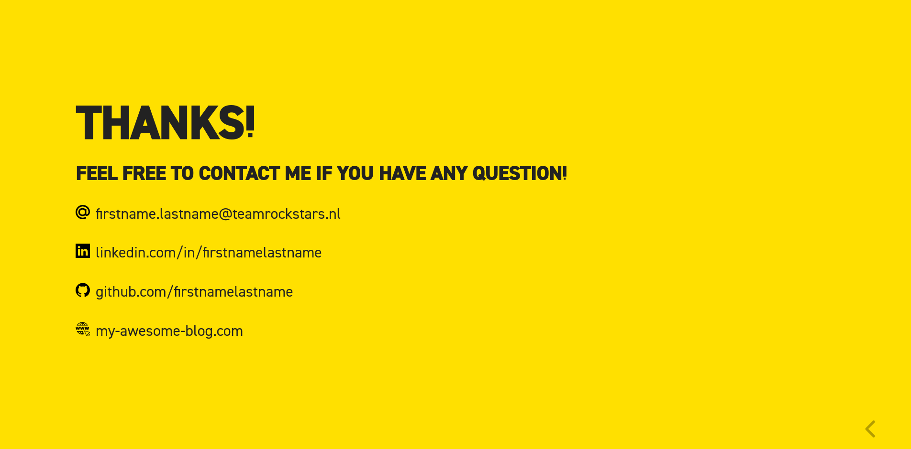

# Rockstars theme for Reveal-js presentations

An attempt to create a reusable theme for Reveal presentations. This theme can be used with [reveal-js](https://revealjs.com) or [reveal-md](https://github.com/webpro/reveal-md) and even with reveal in Docker: [reveal.js on steroids](https://github.com/webpro/reveal-md). With this theme it is possible to create reusable presentations in the Rockstars layout.

## Screenshots










## Getting started

Install sass

``` bash
npm install -g sass
```

* Generate new theme

``` bash
sass theme/source/rockstars.scss theme/rockstars.css
```

* Test the template

``` bash
docker run --rm -p 1948:1948 -p 35729:35729 -v $(pwd)/example:/slides -v $(pwd)/theme:/slides/theme webpronl/reveal-md:latest /slides --theme theme/rockstars.css --watch
```

## Using it for your own presentations

Create a separate repository where you store your presentations. Add this repository as a submodule and generate a new theme css file. Include it in your docker command or reveal installation. More documentation will come here!

## Ideas

- Add blocks from the website to create links
- Better tables
- Different color-schemes (She's a rockstar pink?)

## Sources

- [Creating Custom Presentation Themes for Reveal.js](https://webdesign.tutsplus.com/courses/creating-custom-presentation-themes-for-revealjs/lessons/welcome-to-the-course)
